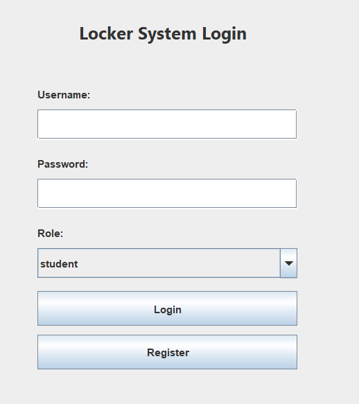
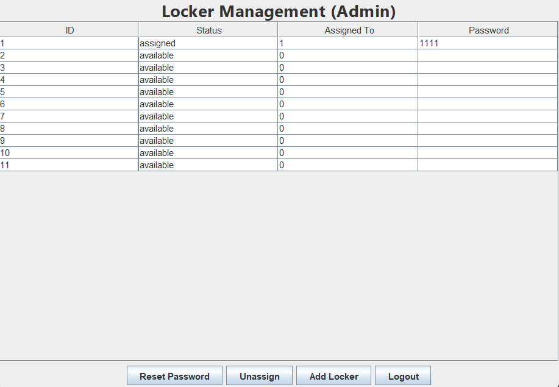

🗄️ Locker Management System

A simple Java + MySQL based locker management system designed for Class 12 Computer Science Project / IA.
Students can register, assign lockers, and manage passwords, while admins manage all lockers through a clean Java Swing interface.

✨ Features
👨‍🎓 Student Features

Student registration

Student login

View available lockers

Assign only one locker

View assigned locker details

Change locker password

Logout

👨‍💼 Admin Features

Admin login

View all lockers

Reset locker passwords

Unassign lockers

Add new lockers

Logout

🛠️ Tech Stack
Component	Technology
Frontend	Java Swing
Backend	Java
Database	MySQL
JDBC Driver	mysql-connector-j 9.5.0
Build System	Manual compile & run
📂 Project Folder Structure
shiven_project/
│
├── src/
│   ├── Main.java
│   ├── db/
│   │   └── DBConnection.java
│   ├── models/
│   │   ├── User.java
│   │   └── Locker.java
│   ├── services/
│   │   ├── UserService.java
│   │   └── LockerService.java
│   └── ui/
│       ├── LoginFrame.java
│       ├── RegisterFrame.java
│       ├── StudentDashboard.java
│       ├── LockerListFrame.java
│       ├── SetPasswordFrame.java
│       └── AdminDashboard.java
│
├── lib/
│   └── mysql-connector-j-9.5.0.jar
│
├── out/
│
└── README.md

⚙️ SQL Setup

Run these commands in MySQL:

CREATE DATABASE locker_system;
USE locker_system;

DROP TABLE IF EXISTS lockers;
DROP TABLE IF EXISTS users;

CREATE TABLE users (
    user_id INT AUTO_INCREMENT PRIMARY KEY,
    username VARCHAR(50) NOT NULL UNIQUE,
    password VARCHAR(100) NOT NULL,
    role VARCHAR(10) NOT NULL,
    full_name VARCHAR(100)
);

CREATE TABLE lockers (
    locker_id INT PRIMARY KEY,
    status VARCHAR(20) DEFAULT 'available',
    assigned_to INT NULL,
    locker_password VARCHAR(20),
    FOREIGN KEY (assigned_to) REFERENCES users(user_id)
);

INSERT INTO users (username, password, role, full_name)
VALUES ('admin01', 'admin123', 'admin', 'Administrator 01');

INSERT INTO users (username, password, role, full_name)
VALUES 
('stu101', 'pass101', 'student', 'Student One'),
('stu102', 'pass102', 'student', 'Student Two'),
('stu103', 'pass103', 'student', 'Student Three');

INSERT INTO lockers (locker_id, status) VALUES
(1, 'available'),
(2, 'available'),
(3, 'available'),
(4, 'available'),
(5, 'available'),
(6, 'available'),
(7, 'available'),
(8, 'available'),
(9, 'available'),
(10, 'available');

UPDATE lockers 
SET status = 'assigned', assigned_to = 1, locker_password = '1111'
WHERE locker_id = 1;

💻 How to Run the Project
1️⃣ Navigate to project folder
cd "D:\Data\Projects\shiven_project"

2️⃣ Delete old compiled files
rmdir /s /q out

3️⃣ Compile all Java files
javac -cp ".;lib\mysql-connector-j-9.5.0.jar" -d out src\db\DBConnection.java src\models\*.java src\services\*.java src\ui\*.java src\Main.java

4️⃣ Run the project
java -cp ".;out;lib\mysql-connector-j-9.5.0.jar" Main

🖼️ Screenshots (Add Later)

Create a folder:

screenshots/

and place PNG/JPG files inside.

🚀 Future Enhancements

Search and filter in Admin Dashboard

Dark mode UI

Export lockers to CSV

OTP-based locker reset

Web-based version (HTML/JS)

📜 License

This project is for educational use (Class 12 CBSE/ISC/IB Computer Science).

👤 Developed By

Lakshya
Locker Management System — Java + MySQL
Class 12 Computer Science Project
